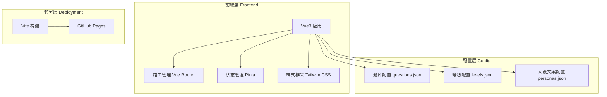

# AISBT AI 认知段位趣味测试 - 技术架构文档

## 1. 架构设计



## 2. 技术说明

- **前端框架**：Vue 3 + Composition API
- **构建工具**：Vite
- **样式方案**：TailwindCSS 3
- **路由管理**：Vue Router 4
- **状态管理**：Pinia（轻量级状态管理）
- **后端服务**：无
- **数据库**：无
- **部署方式**：GitHub Pages 静态部署

## 3. 路由定义

| 路由 | 用途 | 组件 |
|-----|------|-----|
| `/` | 首页 - MBTI 选择和项目介绍 | Home.vue |
| `/quiz` | 答题页 - 25 题测试 | Quiz.vue |
| `/result` | 结果页 - 段位展示和解读 | Result.vue |

## 4. 数据流设计


## 5. 配置文件结构

### 5.1 题库配置 (questions.json)

```json
{
  "professional": [
    {
      "id": 1,
      "question": "题目内容",
      "options": ["选项A", "选项B", "选项C", "选项D"],
      "answer": 0,
      "score": 10
    }
  ],
  "fun": [
    {
      "id": 19,
      "question": "趣味题目内容",
      "options": ["选项A", "选项B", "选项C"],
      "answer": 1,
      "score": 5
    }
  ]
}
```

### 5.2 等级配置 (levels.json)

```json
{
  "levels": [
    {
      "level": 1,
      "title": "门外小白",
      "minScore": 0,
      "maxScore": 50,
      "professionalDesc": "专业能力描述",
      "personas": ["persona_1", "persona_2", "persona_3"]
    }
  ]
}
```

### 5.3 人设文案配置 (personas.json)

```json
{
  "personas": {
    "L1_1": {
      "name": "纯小白",
      "mbtiType": "E",
      "aiAbilityDesc": "AI 能力解读内容",
      "personalityDesc": "性格解读内容"
    }
  }
}
```

## 6. 核心模块设计

### 6.1 Store 设计 (Pinia)

```typescript
// stores/quiz.ts
interface QuizState {
  mbti: string | null;
  answers: Record<number, number>;
  currentQuestion: number;
  totalScore: number;
  result: Result | null;
}
```

### 6.2 计分逻辑

```typescript
// 计算总分
function calculateScore(answers, questions) {
  return questions.reduce((total, q) => {
    return total + (answers[q.id] === q.answer ? q.score : 0);
  }, 0);
}

// 匹配等级
function matchLevel(score, levels) {
  return levels.find(l => score >= l.minScore && score <= l.maxScore);
}

// 匹配人设
function matchPersona(mbti, level) {
  // I/E 判断
  const isIntrovert = mbti.startsWith('I');
  // 理性型判断 (T)
  const isRational = mbti.includes('T');
  // 返回对应人设 ID
  return getPersonaId(level, isIntrovert, isRational);
}
```

## 7. 项目目录结构

```
AISBT/
├── .trae/
│   └── documents/
│       ├── prd.md
│       └── technical-architecture.md
├── public/
│   └── images/           # 配图占位目录
├── src/
│   ├── assets/
│   ├── components/
│   │   ├── MBTISelector.vue
│   │   ├── QuestionCard.vue
│   │   ├── ProgressBar.vue
│   │   ├── ResultCard.vue
│   │   └── ShareButton.vue
│   ├── config/
│   │   ├── questions.json
│   │   ├── levels.json
│   │   └── personas.json
│   ├── router/
│   │   └── index.ts
│   ├── stores/
│   │   └── quiz.ts
│   ├── views/
│   │   ├── Home.vue
│   │   ├── Quiz.vue
│   │   └── Result.vue
│   ├── App.vue
│   └── main.ts
├── index.html
├── package.json
├── tailwind.config.js
├── tsconfig.json
└── vite.config.ts
```

## 8. 性能优化

- **代码分割**：路由懒加载
- **资源压缩**：Vite 自动处理
- **CSS 优化**：TailwindCSS 按需生成
- **无网络请求**：所有数据本地加载

## 9. 兼容性要求

- **浏览器**：Chrome 90+, Safari 14+, Firefox 88+, Edge 90+
- **移动端**：iOS Safari 14+, Android Chrome 90+
- **屏幕尺寸**：320px - 2560px

## 10. 部署说明

1. 执行 `npm run build` 构建生产版本
2. 将 `dist` 目录内容上传至 GitHub 仓库
3. 开启 GitHub Pages，选择分支根目录
4. 访问生成的在线网址
